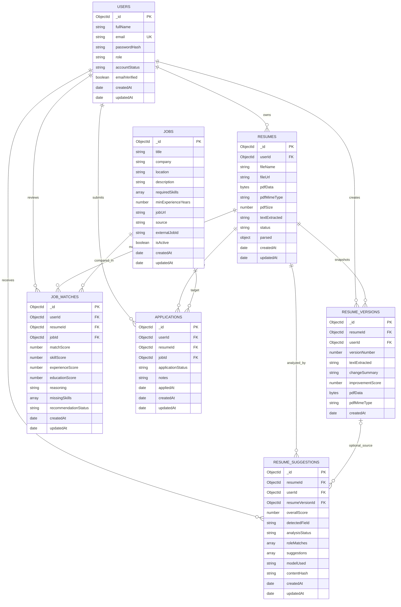

# Backend ERD

This ERD documents the backend data model defined in the Mongoose models under `backend/api/models` and the MongoDB schema bootstrap in `backend/db/resume_app_full_schema.mongodb.js`.

## Entity Relationship Diagram

## Notes

- The backend uses MongoDB with Mongoose, so several structures are embedded documents rather than standalone collections.
- `resumes.parsed.skills`, `resume_suggestions.suggestions`, and `jobs.requiredSkills` are nested arrays stored inside their parent documents.
- `resumeVersionId` on `resume_suggestions` is optional, so not every suggestion record is tied to a saved resume version.
- `applications` is defined in the MongoDB schema bootstrap file, but there is no matching Mongoose model or API route in `backend/api` yet.

## Key Constraints

- `users.email` is unique.
- `resumes` is unique on `(userId, fileName)`.
- `resume_versions` is unique on `(resumeId, versionNumber)`.
- `jobs` is unique on `(source, externalJobId)` when `externalJobId` is present.
- `job_matches` is unique on `(userId, resumeId, jobId)`.
- `applications` is unique on `(userId, jobId, resumeId)`.
- `resume_suggestions` includes a deduplication index on `(userId, contentHash, analysisStatus)`.
