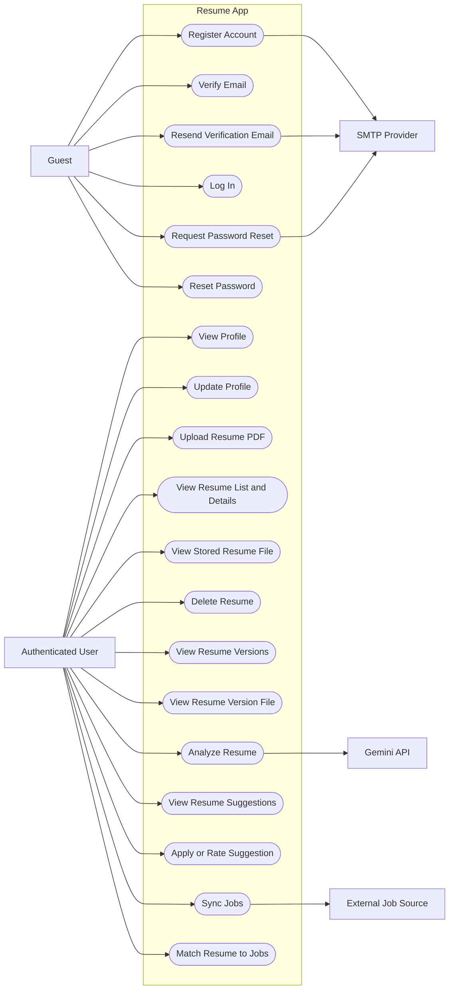

# Use Case Diagram

This diagram summarizes the main backend-supported user flows and the external services the system depends on.

## Diagram

## Scope Notes

- The diagram reflects implemented backend routes in `backend/api/routes`.
- `Sync Jobs` is currently protected by authentication, but there is no separate admin-only route in the current API.
- `Analyze Resume` depends on Gemini, while registration, verification, and password reset flows depend on SMTP email delivery.
- The Mongo schema defines an `applications` collection, but application submission and tracking are not exposed through the current API, so they are not shown as active use cases here.
